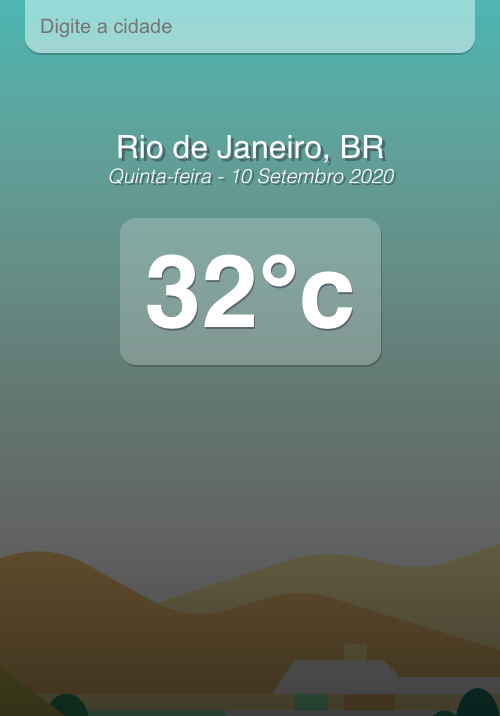

# React Weather App

##### [Live Demo](http://nandotempo.app/)

  

 

### API

http://openweathermap.org/

### Run the Project

+ Clone this repo ``
+ `cd react-weather-app`
+ run `npm install`
+ Get your API key from http://openweathermap.org/
+ run `npm start`

This project was bootstrapped with [Create React App](https://github.com/facebook/create-react-app).
